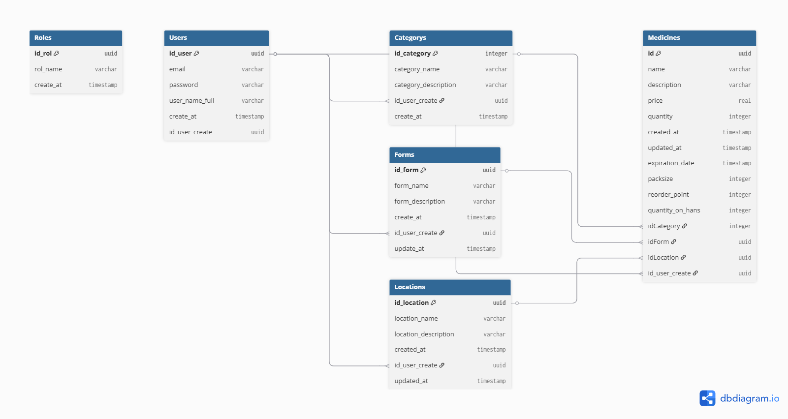

# 🗃️ Base de Datos (PostgreSQL + Prisma)

## Diagrama de Entidad-Relación (ER)

*(Generado con [dbdiagram.io](https://dbdiagram.io))*

## Schema Prisma (`prisma/schema.prisma`)
generator client {
  provider        = "prisma-client-js"
  previewFeatures = ["postgresqlExtensions", "views"]
}

datasource db {
  provider   = "postgresql"
  url        = env("DATABASE_URL")
  extensions = [pgcrypto, uuid_ossp(map: "uuid-ossp", schema: "public")]
}

model Categories {
  category_name        String
  id_category          Int       @id(map: "category_pkey") @default(autoincrement())
  category_description String?
  id_user_create       String    @db.Uuid
  create_at            DateTime? @default(now()) @db.Timestamp(6)
}

model Forms {
  id_form          String    @id @default(dbgenerated("uuid_generate_v4()")) @db.Uuid
  form_name        String
  form_description String?
  create_at        DateTime  @default(now()) @db.Timestamp(6)
  id_user_create   String    @db.Uuid
  update_at        DateTime? @db.Timestamp(6)
}

model Locations {
  id_location          String    @id @default(dbgenerated("uuid_generate_v4()")) @db.Uuid
  location_name        String
  location_description String?
  created_at           DateTime  @default(now()) @db.Timestamp(6)
  id_user_create       String    @db.Uuid
  updated_at           DateTime? @db.Timestamp(6)
}

model Medicines {
  id               String    @id @default(dbgenerated("uuid_generate_v4()")) @db.Uuid
  name             String
  description      String
  price            Float?    @db.Real
  quantity         Int       @default(1)
  created_at       DateTime  @default(now()) @db.Timestamp(6)
  updated_at       DateTime? @db.Timestamp(6)
  expiration_date  DateTime  @db.Timestamp(6)
  packsize         Int       @default(1)
  reorder_point    Int       @default(1)
  quantity_on_hans Int?      @default(dbgenerated("(quantity * packsize)"))
  idCategory       Int       @default(1)
  idForm           String    @db.Uuid
  idLocation       String    @db.Uuid
  id_user_create   String    @db.Uuid
}

model Users {
  id_user        String    @id @default(dbgenerated("uuid_generate_v4()")) @db.Uuid
  email          String
  password       String
  user_name_full String?
  create_at      DateTime? @default(now()) @db.Timestamp(6)
  id_user_create String    @db.Uuid
}

model Roles {
  id_rol    String    @id @default(dbgenerated("uuid_generate_v4()")) @db.Uuid
  rol_name  String
  create_at DateTime? @default(now()) @db.Timestamp(6)
}

view Medicines_Table {
  id               String    @unique @db.Uuid
  name_medicine    String?
  description      String
  price            Float?    @db.Real
  quantity         Int
  created_at       DateTime  @db.Timestamp(6)
  updated_at       DateTime? @db.Timestamp(6)
  expiration_date  DateTime  @db.Timestamp(6)
  idCategory       Int
  idForm           String    @db.Uuid
  packsize         Int
  reorder_point    Int
  idLocation       String    @db.Uuid
  quantity_on_hans Int?
  category_name    String?
  form_name        String?
  location_name    String
  id_user_create   String    @db.Uuid
}
